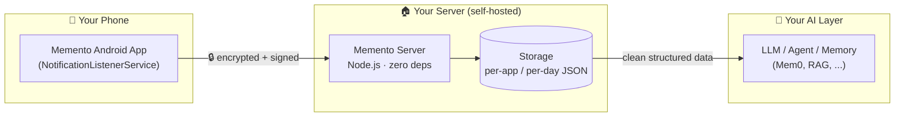

<p align="center">
  
  
  
  
  
</p>

<p align="center"><b>English</b> · <a href="README.zh-CN.md">中文</a></p>

<h1 align="center">📲 Memento</h1>

<p align="center"><b>Turn every phone notification into context your AI never forgets.</b></p>

<p align="center">
  Memento captures your Android notifications, encrypts them end-to-end, and streams them
  to your own server — building a <b>privacy-first, AI-ready memory pipeline</b> from the
  most authentic data stream on your device: what your apps actually tell you.
</p>

---

## ✨ Why Memento?

Your notifications are a real-time diary of your life: payments, messages, reminders, app
activity. Most notification tools either **sell your data** or **lock it in a silo**.
Memento gives you:

- 🔐 **End-to-end encryption** — AES-256-GCM payloads + HMAC-signed envelopes. Your server never sees plaintext on the wire.
- 🏠 **100% self-hosted** — a single Node.js file, zero dependencies, runs on anything (Raspberry Pi, VPS, old laptop).
- 🧠 **AI-ready output** — clean, structured, per-app / per-day JSON that LLMs, agents, and memory systems (like Mem0) can consume directly.
- 📡 **Real-time capture** — Android's NotificationListenerService feeds events the moment they appear.
- 🔋 **Battery-friendly** — lightweight collector with optional keep-alive and boot recovery.

> Think of it as a **notification harness for your AI memory**: your phone produces the
> context, Memento transports it safely, and your LLM / agent / knowledge base turns it
> into something you can actually recall.

## 🏗️ Architecture



## 🚀 Quick Start

### One-line server install (~30 seconds, idempotent)

```bash
curl -fsSL https://raw.githubusercontent.com/Lecheeel/memento/main/server/install.sh | sudo bash -s 49033
```

What it does:
1. Downloads the server (`index.mjs` — a single file, no dependencies, Node.js ≥ 18)
2. Generates pairing keys (`deviceToken` + `encryptionSecret`), or **preserves existing ones** on re-run
3. Installs a hardened systemd service (`memento.service`) with auto-start
4. Runs a self-check and prints your Android pairing info

> 💡 Re-running the script is safe: your keys and data are kept, only the code is updated.
> Change the port anytime: `sudo bash install.sh 8080`

### Android app

1. Clone and build the app (`app/`, Kotlin):
   ```bash
   git clone https://github.com/Lecheeel/memento.git
   cd memento/app && ./gradlew assembleDebug
   ```
2. Install the APK, grant **Notification access**.
3. Enter your server URL, `deviceToken`, and `encryptionSecret` (printed by the installer).
4. Pick which apps to capture (whitelist / blacklist).

## 🔧 Server API

| Endpoint | Method | Description |
|---|---|---|
| `/health` | GET | Liveness check → `{"ok": true}` |
| `/ingest` | POST | Receive encrypted notification envelopes |
| `/events?limit=N` | GET | Query recent events (max 200) |

## 🛡️ Security & Privacy

- **HMAC-SHA256** signature on every envelope (replay-resistant via timestamp + clock-skew check)
- **AES-256-GCM** payload encryption — only your `encryptionSecret` can decrypt
- **No third-party services**: nothing leaves your infrastructure
- Request body capped (64 KB) and storage is plain JSON on your own disk

## 🗺️ Roadmap

- [ ] Server code modularization (currently a single-file design by choice)
- [ ] iOS / desktop collectors
- [ ] Webhook / MCP connectors for AI agents
- [ ] Built-in LLM summarization pipeline

## 🤝 Contributing

PRs are welcome! Please follow [Conventional Commits](https://www.conventionalcommits.org/).
Ideas, bugs, and feature requests → [Issues](https://github.com/Lecheeel/memento/issues).

## 📄 License

MIT — feel free to use, fork, and build on it.
