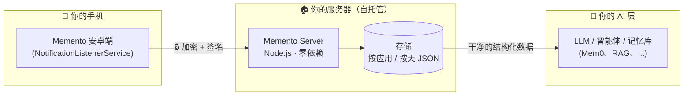

<p align="center">
  
  
  
  
  
  
</p>

<p align="center"><a href="README.md">English</a> · <b>中文</b></p>

<h1 align="center">📲 Memento</h1>

<p align="center"><b>把每一条手机通知，变成你的 AI 永不遗忘的上下文。</b></p>

<p align="center">
  Memento 采集安卓通知，端到端加密后上传到你自己的服务器 —— 用设备上最真实的数据流
  （应用真正告诉你的信息），构建一条<b>隐私优先、AI 就绪的记忆管道</b>。
</p>

---

## ✨ 为什么用 Memento？

你的通知就是一部实时生活日记：支付、消息、提醒、应用动态。大多数通知工具要么
**出卖你的数据**，要么**把数据锁在孤岛里**。Memento 给你的是：

- 🔐 **端到端加密** —— AES-256-GCM 载荷 + HMAC 签名封包，传输过程服务器看到的只有密文。
- 🏠 **100% 自托管** —— 服务端只有一个 Node.js 文件，零依赖，树莓派 / VPS / 旧笔记本都能跑。
- 🧠 **AI 就绪输出** —— 干净、结构化、按应用 / 按天组织的 JSON，LLM、智能体、记忆系统（如 Mem0）可直接消费。
- 📡 **实时采集** —— 基于 Android NotificationListenerService，通知一出现即刻上报。
- 🔋 **省电轻量** —— 轻量采集器，可选保活与开机恢复。

> 把它理解为**给 AI 记忆用的通知管道（notification harness）**：手机产生上下文，
> Memento 安全搬运，你的 LLM / 智能体 / 知识库把它变成真正能回忆的东西。

## 🏗️ 架构



## 🚀 快速开始

### 服务端一键安装（约 30 秒，幂等）

```bash
curl -fsSL https://raw.githubusercontent.com/Lecheeel/memento/main/server/install.sh | sudo bash -s 49033
```

脚本会：
1. 下载服务端（`index.mjs` 单文件，零依赖，需要 Node.js ≥ 18）
2. 生成配对密钥（`deviceToken` + `encryptionSecret`），**重复执行保留已有密钥**
3. 安装加固的 systemd 服务（`memento.service`）并开机自启
4. 自检并打印安卓端配对信息

> 💡 脚本可重复执行：密钥和数据都会保留，只会更新代码。
> 随时换端口：`sudo bash install.sh 8080`

### 安卓端

1. 克隆并构建应用（`app/`，Kotlin）：
   ```bash
   git clone https://github.com/Lecheeel/memento.git
   cd memento/app && ./gradlew assembleDebug
   ```
2. 安装 APK，授予**通知使用权**。
3. 填入服务器地址、`deviceToken`、`encryptionSecret`（安装脚本会打印）。
4. 选择要采集的应用（白名单 / 黑名单）。

## 🔧 服务端 API

| 端点 | 方法 | 说明 |
|---|---|---|
| `/health` | GET | 健康检查 → `{"ok": true}` |
| `/ingest` | POST | 接收加密的通知封包 |
| `/events?limit=N` | GET | 查询最近事件（最多 200 条）|

## 🛡️ 安全与隐私

- 每个封包带 **HMAC-SHA256** 签名（时间戳 + 时钟偏移校验，防重放）
- **AES-256-GCM** 载荷加密 —— 只有你的 `encryptionSecret` 能解密
- **无任何第三方服务**：数据不出你的基础设施
- 请求体上限 64KB，存储为你磁盘上的纯 JSON

## 🗺️ 路线图

- [ ] 服务端代码模块化（当前按设计保持单文件）
- [ ] iOS / 桌面端采集器
- [ ] 面向 AI 智能体的 Webhook / MCP 连接器
- [ ] 内置 LLM 摘要管道

## 🤝 参与贡献

欢迎 PR！请遵循 [Conventional Commits](https://www.conventionalcommits.org/)。
想法、Bug、功能建议 → [Issues](https://github.com/Lecheeel/memento/issues)。

## 📄 许可证

MIT —— 随意使用、fork、二次开发。
